## Graphs
 All times are specified in seconds
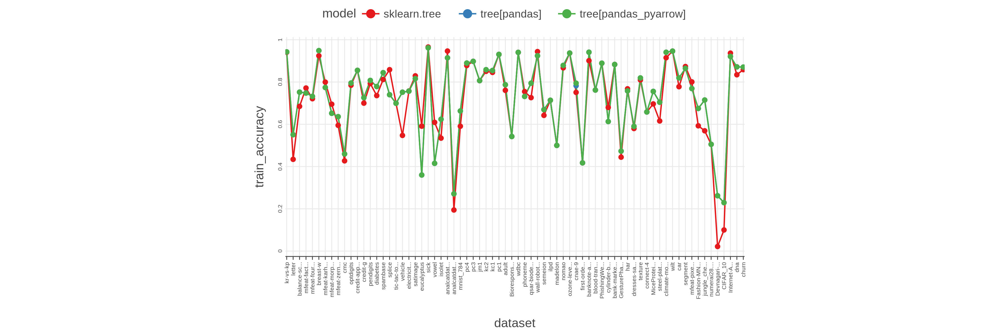

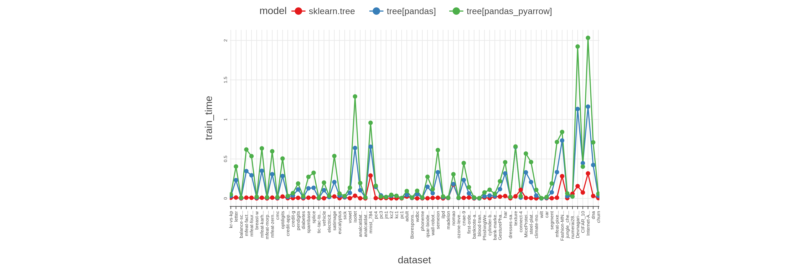

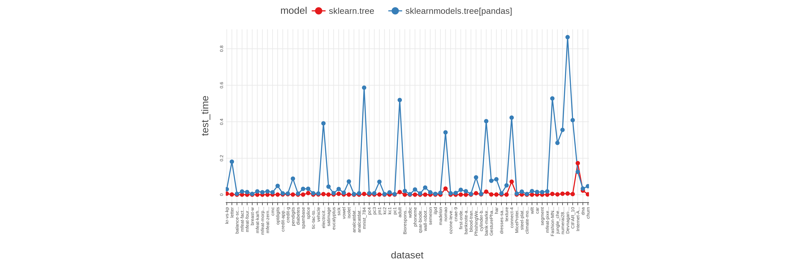

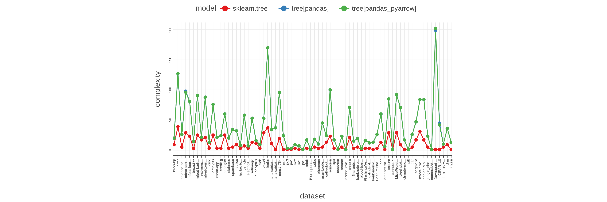

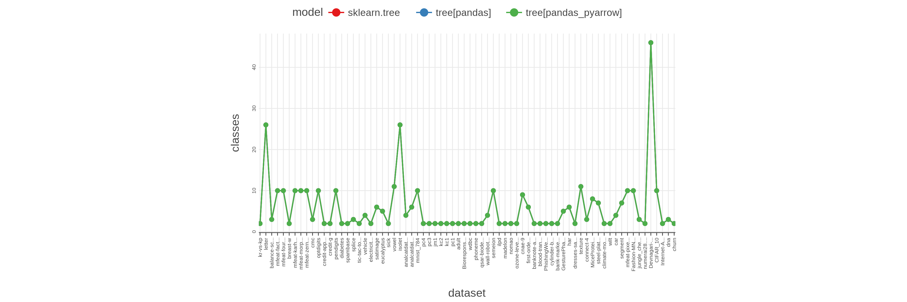

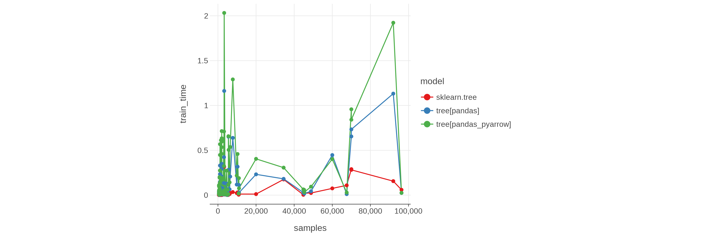

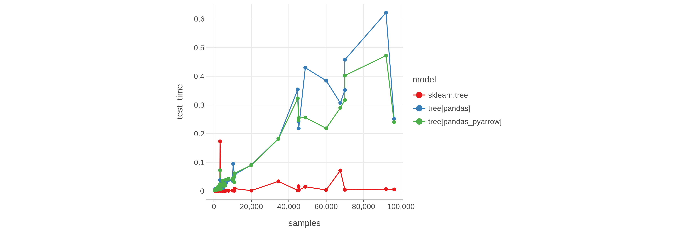

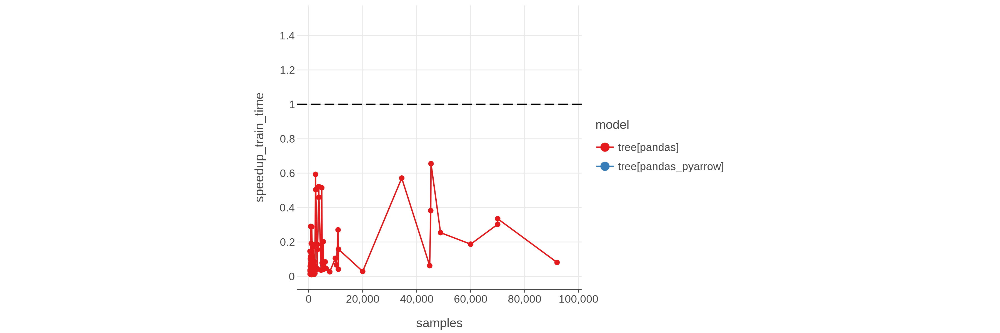

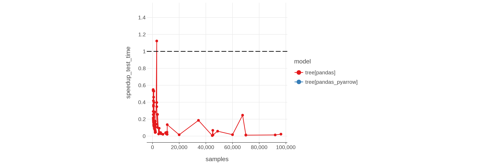

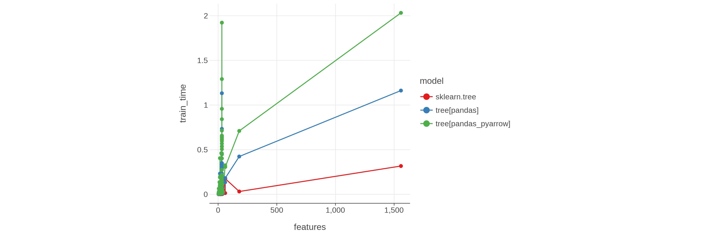

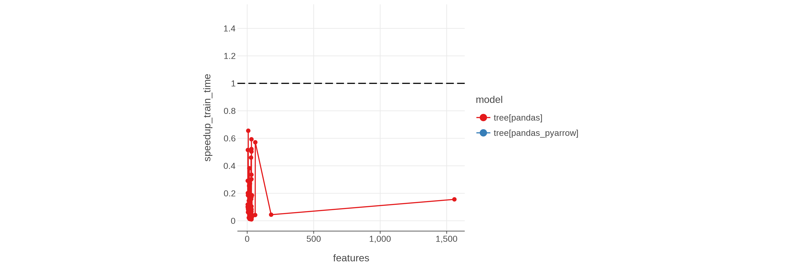

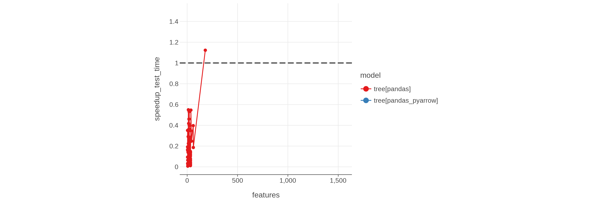

# Benchmark table
| model                      | dataset                                |   train_accuracy |   train_time |   test_time |   samples |   features |   classes |   complexity | id                                                                |
|:---------------------------|:---------------------------------------|-----------------:|-------------:|------------:|----------:|-----------:|----------:|-------------:|:------------------------------------------------------------------|
| sklearn.tree               | kr-vs-kp                               |        0.940864  |   0.00941934 | 0.00609999  |      3196 |         36 |         2 |            9 | sklearn.tree_kr-vs-kp                                             |
| sklearn.tree               | letter                                 |        0.43415   |   0.0117543  | 0.00144858  |     20000 |         16 |        26 |           39 | sklearn.tree_letter                                               |
| sklearn.tree               | balance-scale                          |        0.6848    |   0.00111367 | 0.000485289 |       625 |          4 |         3 |            5 | sklearn.tree_balance-scale                                        |
| sklearn.tree               | mfeat-factors                          |        0.7715    |   0.0100323  | 0.000654465 |      2000 |         32 |        10 |           29 | sklearn.tree_mfeat-factors                                        |
| sklearn.tree               | mfeat-fourier                          |        0.721     |   0.00863509 | 0.000491809 |      2000 |         32 |        10 |           23 | sklearn.tree_mfeat-fourier                                        |
| sklearn.tree               | breast-w                               |        0.924177  |   0.00148999 | 0.000538647 |       699 |          9 |         2 |            3 | sklearn.tree_breast-w                                             |
| sklearn.tree               | mfeat-karhunen                         |        0.7995    |   0.00918156 | 0.00043552  |      2000 |         32 |        10 |           25 | sklearn.tree_mfeat-karhunen                                       |
| sklearn.tree               | mfeat-morphological                    |        0.695     |   0.00133793 | 0.000489855 |      2000 |          6 |        10 |           17 | sklearn.tree_mfeat-morphological                                  |
| sklearn.tree               | mfeat-zernike                          |        0.595     |   0.0105796  | 0.000601586 |      2000 |         32 |        10 |           21 | sklearn.tree_mfeat-zernike                                        |
| sklearn.tree               | cmc                                    |        0.42702   |   0.00199739 | 0.0009875   |      1473 |          9 |         3 |            3 | sklearn.tree_cmc                                                  |
| sklearn.tree               | optdigits                              |        0.784698  |   0.0242732  | 0.00101418  |      5620 |         32 |        10 |           25 | sklearn.tree_optdigits                                            |
| sklearn.tree               | credit-approval                        |        0.855072  |   0.0036105  | 0.00154679  |       690 |         15 |         2 |            3 | sklearn.tree_credit-approval                                      |
| sklearn.tree               | credit-g                               |        0.7       |   0.0043952  | 0.00289884  |      1000 |         20 |         2 |            3 | sklearn.tree_credit-g                                             |
| sklearn.tree               | pendigits                              |        0.792576  |   0.0079085  | 0.00106827  |     10992 |         16 |        10 |           25 | sklearn.tree_pendigits                                            |
| sklearn.tree               | diabetes                               |        0.735677  |   0.00215827 | 0.000713208 |       768 |          8 |         2 |            3 | sklearn.tree_diabetes                                             |
| sklearn.tree               | spambase                               |        0.81178   |   0.00992198 | 0.00092868  |      4601 |         32 |         2 |            5 | sklearn.tree_spambase                                             |
| sklearn.tree               | splice                                 |        0.858307  |   0.0136182  | 0.00929136  |      3190 |         60 |         3 |            9 | sklearn.tree_splice                                               |
| sklearn.tree               | tic-tac-toe                            |        0.699374  |   0.00172359 | 0.000952873 |       958 |          9 |         2 |            3 | sklearn.tree_tic-tac-toe                                          |
| sklearn.tree               | vehicle                                |        0.547281  |   0.00272544 | 0.00164283  |       846 |         18 |         4 |            7 | sklearn.tree_vehicle                                              |
| sklearn.tree               | electricity                            |        0.757393  |   0.0214567  | 0.0034724   |     45312 |          8 |         2 |            3 | sklearn.tree_electricity                                          |
| sklearn.tree               | satimage                               |        0.829082  |   0.024758   | 0.00111054  |      6430 |         32 |         6 |           13 | sklearn.tree_satimage                                             |
| sklearn.tree               | eucalyptus                             |        0.591033  |   0.00321958 | 0.00162443  |       736 |         19 |         5 |           11 | sklearn.tree_eucalyptus                                           |
| sklearn.tree               | sick                                   |        0.965536  |   0.0138799  | 0.00508571  |      3772 |         29 |         2 |            3 | sklearn.tree_sick                                                 |
| sklearn.tree               | vowel                                  |        0.609091  |   0.00306777 | 0.00149294  |       990 |         12 |        11 |           29 | sklearn.tree_vowel                                                |
| sklearn.tree               | isolet                                 |        0.534436  |   0.0345167  | 0.000928945 |      7797 |         32 |        26 |           37 | sklearn.tree_isolet                                               |
| sklearn.tree               | analcatdata_authorship                 |        0.946492  |   0.0025032  | 0.000505226 |       841 |         32 |         4 |           11 | sklearn.tree_analcatdata_authorship                               |
| sklearn.tree               | analcatdata_dmft                       |        0.194479  |   0.00138337 | 0.000729767 |       797 |          4 |         6 |            1 | sklearn.tree_analcatdata_dmft                                     |
| sklearn.tree               | mnist_784                              |        0.590686  |   0.289782   | 0.00444116  |     70000 |         32 |        10 |           19 | sklearn.tree_mnist_784                                            |
| sklearn.tree               | pc4                                    |        0.877915  |   0.00434503 | 0.00100518  |      1458 |         32 |         2 |            1 | sklearn.tree_pc4                                                  |
| sklearn.tree               | pc3                                    |        0.897633  |   0.00412089 | 0.0013      |      1563 |         32 |         2 |            1 | sklearn.tree_pc3                                                  |
| sklearn.tree               | jm1                                    |        0.806523  |   0.00490459 | 0.00143719  |     10885 |         21 |         2 |            1 | sklearn.tree_jm1                                                  |
| sklearn.tree               | kc2                                    |        0.850575  |   0.0017027  | 0.00090623  |       522 |         21 |         2 |            3 | sklearn.tree_kc2                                                  |
| sklearn.tree               | kc1                                    |        0.845424  |   0.00216392 | 0.00109744  |      2109 |         21 |         2 |            1 | sklearn.tree_kc1                                                  |
| sklearn.tree               | pc1                                    |        0.930568  |   0.00175379 | 0.000942957 |      1109 |         21 |         2 |            1 | sklearn.tree_pc1                                                  |
| sklearn.tree               | adult                                  |        0.760718  |   0.023946   | 0.0148682   |     48842 |         14 |         2 |            3 | sklearn.tree_adult                                                |
| sklearn.tree               | Bioresponse                            |        0.542255  |   0.00573755 | 0.000741959 |      3751 |         32 |         2 |            1 | sklearn.tree_Bioresponse                                          |
| sklearn.tree               | wdbc                                   |        0.940246  |   0.0016605  | 0.000548557 |       569 |         30 |         2 |            5 | sklearn.tree_wdbc                                                 |
| sklearn.tree               | phoneme                                |        0.754626  |   0.00232092 | 0.000582946 |      5404 |          5 |         2 |            3 | sklearn.tree_phoneme                                              |
| sklearn.tree               | qsar-biodeg                            |        0.726066  |   0.00278051 | 0.00051437  |      1055 |         32 |         2 |            5 | sklearn.tree_qsar-biodeg                                          |
| sklearn.tree               | wall-robot-navigation                  |        0.943915  |   0.00690477 | 0.000708256 |      5456 |         24 |         4 |           13 | sklearn.tree_wall-robot-navigation                                |
| sklearn.tree               | semeion                                |        0.642185  |   0.00886484 | 0.000624851 |      1593 |         32 |        10 |           23 | sklearn.tree_semeion                                              |
| sklearn.tree               | ilpd                                   |        0.713551  |   0.00152039 | 0.000867988 |       583 |         10 |         2 |            3 | sklearn.tree_ilpd                                                 |
| sklearn.tree               | madelon                                |        0.5       |   0.00536233 | 0.000720126 |      2600 |         32 |         2 |            1 | sklearn.tree_madelon                                              |
| sklearn.tree               | nomao                                  |        0.866937  |   0.175216   | 0.0337855   |     34465 |         61 |         2 |            5 | sklearn.tree_nomao                                                |
| sklearn.tree               | ozone-level-8hr                        |        0.936859  |   0.0059486  | 0.000698193 |      2534 |         32 |         2 |            1 | sklearn.tree_ozone-level-8hr                                      |
| sklearn.tree               | cnae-9                                 |        0.750926  |   0.00765257 | 0.000583886 |      1080 |         32 |         9 |           21 | sklearn.tree_cnae-9                                               |
| sklearn.tree               | first-order-theorem-proving            |        0.417457  |   0.012009   | 0.000858281 |      6118 |         32 |         6 |            3 | sklearn.tree_first-order-theorem-proving                          |
| sklearn.tree               | banknote-authentication                |        0.900875  |   0.00122001 | 0.000451584 |      1372 |          4 |         2 |            5 | sklearn.tree_banknote-authentication                              |
| sklearn.tree               | blood-transfusion-service-center       |        0.762032  |   0.00128128 | 0.000810482 |       748 |          4 |         2 |            1 | sklearn.tree_blood-transfusion-service-center                     |
| sklearn.tree               | PhishingWebsites                       |        0.888919  |   0.012003   | 0.00833725  |     11055 |         30 |         2 |            3 | sklearn.tree_PhishingWebsites                                     |
| sklearn.tree               | cylinder-bands                         |        0.67963   |   0.00347455 | 0.0020725   |       540 |         37 |         2 |            3 | sklearn.tree_cylinder-bands                                       |
| sklearn.tree               | bank-marketing                         |        0.883015  |   0.0225422  | 0.0168063   |     45211 |         16 |         2 |            1 | sklearn.tree_bank-marketing                                       |
| sklearn.tree               | GesturePhaseSegmentationProcessed      |        0.444343  |   0.0229664  | 0.00161743  |      9873 |         32 |         5 |            3 | sklearn.tree_GesturePhaseSegmentationProcessed                    |
| sklearn.tree               | har                                    |        0.767744  |   0.0306944  | 0.00124267  |     10299 |         32 |         6 |           13 | sklearn.tree_har                                                  |
| sklearn.tree               | dresses-sales                          |        0.58      |   0.00260177 | 0.0014688   |       500 |         12 |         2 |            1 | sklearn.tree_dresses-sales                                        |
| sklearn.tree               | texture                                |        0.809818  |   0.0269271  | 0.00096667  |      5500 |         32 |        11 |           29 | sklearn.tree_texture                                              |
| sklearn.tree               | connect-4                              |        0.658303  |   0.109325   | 0.0716388   |     67557 |         42 |         3 |            1 | sklearn.tree_connect-4                                            |
| sklearn.tree               | MiceProtein                            |        0.696296  |   0.00702073 | 0.00127044  |      1080 |         32 |         8 |           29 | sklearn.tree_MiceProtein                                          |
| sklearn.tree               | steel-plates-fault                     |        0.615662  |   0.00516236 | 0.00126842  |      1941 |         27 |         7 |            9 | sklearn.tree_steel-plates-fault                                   |
| sklearn.tree               | climate-model-simulation-crashes       |        0.914815  |   0.00143716 | 0.000475109 |       540 |         18 |         2 |            1 | sklearn.tree_climate-model-simulation-crashes                     |
| sklearn.tree               | wilt                                   |        0.946063  |   0.00212074 | 0.000592605 |      4839 |          5 |         2 |            1 | sklearn.tree_wilt                                                 |
| sklearn.tree               | car                                    |        0.777778  |   0.00336184 | 0.00137517  |      1728 |          6 |         4 |            5 | sklearn.tree_car                                                  |
| sklearn.tree               | segment                                |        0.87316   |   0.00341806 | 0.000753767 |      2310 |         16 |         7 |           17 | sklearn.tree_segment                                              |
| sklearn.tree               | mfeat-pixel                            |        0.8005    |   0.0100875  | 0.000556886 |      2000 |         32 |        10 |           31 | sklearn.tree_mfeat-pixel                                          |
| sklearn.tree               | Fashion-MNIST                          |        0.5928    |   0.281967   | 0.00453878  |     70000 |         32 |        10 |           17 | sklearn.tree_Fashion-MNIST                                        |
| sklearn.tree               | jungle_chess_2pcs_raw_endgame_complete |        0.569178  |   0.00396401 | 0.00207109  |     44819 |          6 |         3 |            5 | sklearn.tree_jungle_chess_2pcs_raw_endgame_complete               |
| sklearn.tree               | numerai28.6                            |        0.50517   |   0.059577   | 0.00559613  |     96320 |         21 |         2 |            1 | sklearn.tree_numerai28.6                                          |
| sklearn.tree               | Devnagari-Script                       |        0.0217391 |   0.156034   | 0.006567    |     92000 |         32 |        46 |            1 | sklearn.tree_Devnagari-Script                                     |
| sklearn.tree               | CIFAR_10                               |        0.1       |   0.0753595  | 0.0037389   |     60000 |         32 |        10 |            1 | sklearn.tree_CIFAR_10                                             |
| sklearn.tree               | Internet-Advertisements                |        0.936566  |   0.316824   | 0.173186    |      3279 |       1558 |         2 |            5 | sklearn.tree_Internet-Advertisements                              |
| sklearn.tree               | dna                                    |        0.834275  |   0.0314556  | 0.0226855   |      3186 |        180 |         3 |            9 | sklearn.tree_dna                                                  |
| sklearn.tree               | churn                                  |        0.8586    |   0.00470132 | 0.00244449  |      5000 |         20 |         2 |            1 | sklearn.tree_churn                                                |
| sklearnmodels.tree[pandas] | kr-vs-kp                               |        0.942428  |   0.186529   | 0.0303698   |      3196 |         36 |         2 |           20 | sklearnmodels.tree[pandas]_kr-vs-kp                               |
| sklearnmodels.tree[pandas] | letter                                 |        0.53355   |   0.692078   | 0.181309    |     20000 |         16 |        26 |          119 | sklearnmodels.tree[pandas]_letter                                 |
| sklearnmodels.tree[pandas] | balance-scale                          |        0.752     |   0.0189965  | 0.00538974  |       625 |          4 |         3 |           26 | sklearnmodels.tree[pandas]_balance-scale                          |
| sklearnmodels.tree[pandas] | mfeat-factors                          |        0.782     |   0.952195   | 0.017923    |      2000 |         32 |        10 |           88 | sklearnmodels.tree[pandas]_mfeat-factors                          |
| sklearnmodels.tree[pandas] | mfeat-fourier                          |        0.7215    |   0.929855   | 0.0148698   |      2000 |         32 |        10 |           87 | sklearnmodels.tree[pandas]_mfeat-fourier                          |
| sklearnmodels.tree[pandas] | breast-w                               |        0.958512  |   0.0511119  | 0.00477825  |       699 |          9 |         2 |           16 | sklearnmodels.tree[pandas]_breast-w                               |
| sklearnmodels.tree[pandas] | mfeat-karhunen                         |        0.7905    |   1.02459    | 0.0184319   |      2000 |         32 |        10 |           94 | sklearnmodels.tree[pandas]_mfeat-karhunen                         |
| sklearnmodels.tree[pandas] | mfeat-morphological                    |        0.676     |   0.0221304  | 0.0137709   |      2000 |          6 |        10 |           19 | sklearnmodels.tree[pandas]_mfeat-morphological                    |
| sklearnmodels.tree[pandas] | mfeat-zernike                          |        0.641     |   1.1186     | 0.0183094   |      2000 |         32 |        10 |           92 | sklearnmodels.tree[pandas]_mfeat-zernike                          |
| sklearnmodels.tree[pandas] | cmc                                    |        0.484046  |   0.0392051  | 0.0134598   |      1473 |          9 |         3 |           12 | sklearnmodels.tree[pandas]_cmc                                    |
| sklearnmodels.tree[pandas] | optdigits                              |        0.785765  |   1.08773    | 0.048716    |      5620 |         32 |        10 |           85 | sklearnmodels.tree[pandas]_optdigits                              |
| sklearnmodels.tree[pandas] | credit-approval                        |        0.855072  |   0.0820126  | 0.00765615  |       690 |         15 |         2 |           21 | sklearnmodels.tree[pandas]_credit-approval                        |
| sklearnmodels.tree[pandas] | credit-g                               |        0.726     |   0.180547   | 0.00671611  |      1000 |         20 |         2 |           22 | sklearnmodels.tree[pandas]_credit-g                               |
| sklearnmodels.tree[pandas] | pendigits                              |        0.771288  |   0.396035   | 0.0883536   |     10992 |         16 |        10 |           60 | sklearnmodels.tree[pandas]_pendigits                              |
| sklearnmodels.tree[pandas] | diabetes                               |        0.785156  |   0.0511741  | 0.00618418  |       768 |          8 |         2 |           20 | sklearnmodels.tree[pandas]_diabetes                               |
| sklearnmodels.tree[pandas] | spambase                               |        0.841556  |   0.458934   | 0.0323416   |      4601 |         32 |         2 |           30 | sklearnmodels.tree[pandas]_spambase                               |
| sklearnmodels.tree[pandas] | splice                                 |        0.739812  |   1.5517     | 0.0328651   |      3190 |         60 |         3 |           32 | sklearnmodels.tree[pandas]_splice                                 |
| sklearnmodels.tree[pandas] | tic-tac-toe                            |        0.699374  |   0.0170361  | 0.00812977  |       958 |          9 |         2 |            8 | sklearnmodels.tree[pandas]_tic-tac-toe                            |
| sklearnmodels.tree[pandas] | vehicle                                |        0.698582  |   0.284611   | 0.00676583  |       846 |         18 |         4 |           45 | sklearnmodels.tree[pandas]_vehicle                                |
| sklearnmodels.tree[pandas] | electricity                            |        0.756555  |   0.0493094  | 0.3913      |     45312 |          8 |         2 |            7 | sklearnmodels.tree[pandas]_electricity                            |
| sklearnmodels.tree[pandas] | satimage                               |        0.825194  |   0.62103    | 0.0445035   |      6430 |         32 |         6 |           42 | sklearnmodels.tree[pandas]_satimage                               |
| sklearnmodels.tree[pandas] | eucalyptus                             |        0.360054  |   0.197093   | 0.00878027  |       736 |         19 |         5 |           16 | sklearnmodels.tree[pandas]_eucalyptus                             |
| sklearnmodels.tree[pandas] | sick                                   |        0.966596  |   0.161596   | 0.0315645   |      3772 |         29 |         2 |            9 | sklearnmodels.tree[pandas]_sick                                   |
| sklearnmodels.tree[pandas] | vowel                                  |        0.382828  |   0.252422   | 0.0108991   |       990 |         12 |        11 |           51 | sklearnmodels.tree[pandas]_vowel                                  |
| sklearnmodels.tree[pandas] | isolet                                 |        0.62524   |   2.01782    | 0.072763    |      7797 |         32 |        26 |          164 | sklearnmodels.tree[pandas]_isolet                                 |
| sklearnmodels.tree[pandas] | analcatdata_authorship                 |        0.902497  |   0.314241   | 0.00389146  |       841 |         32 |         4 |           31 | sklearnmodels.tree[pandas]_analcatdata_authorship                 |
| sklearnmodels.tree[pandas] | analcatdata_dmft                       |        0.271016  |   0.0200939  | 0.00790453  |       797 |          4 |         6 |           37 | sklearnmodels.tree[pandas]_analcatdata_dmft                       |
| sklearnmodels.tree[pandas] | mnist_784                              |        0.664143  |   2.02671    | 0.586758    |     70000 |         32 |        10 |           82 | sklearnmodels.tree[pandas]_mnist_784                              |
| sklearnmodels.tree[pandas] | pc4                                    |        0.895748  |   0.145636   | 0.00802139  |      1458 |         32 |         2 |           11 | sklearnmodels.tree[pandas]_pc4                                    |
| sklearnmodels.tree[pandas] | pc3                                    |        0.897633  |   0.0388661  | 0.00790802  |      1563 |         32 |         2 |            3 | sklearnmodels.tree[pandas]_pc3                                    |
| sklearnmodels.tree[pandas] | jm1                                    |        0.806523  |   0.0474933  | 0.0712061   |     10885 |         21 |         2 |            3 | sklearnmodels.tree[pandas]_jm1                                    |
| sklearnmodels.tree[pandas] | kc2                                    |        0.871648  |   0.168283   | 0.0034905   |       522 |         21 |         2 |           21 | sklearnmodels.tree[pandas]_kc2                                    |
| sklearnmodels.tree[pandas] | kc1                                    |        0.855382  |   0.0926389  | 0.013063    |      2109 |         21 |         2 |            7 | sklearnmodels.tree[pandas]_kc1                                    |
| sklearnmodels.tree[pandas] | pc1                                    |        0.930568  |   0.015249   | 0.00344324  |      1109 |         21 |         2 |            1 | sklearnmodels.tree[pandas]_pc1                                    |
| sklearnmodels.tree[pandas] | adult                                  |        0.787089  |   0.208763   | 0.519241    |     48842 |         14 |         2 |           17 | sklearnmodels.tree[pandas]_adult                                  |
| sklearnmodels.tree[pandas] | Bioresponse                            |        0.632365  |   0.183165   | 0.020491    |      3751 |         32 |         2 |            8 | sklearnmodels.tree[pandas]_Bioresponse                            |
| sklearnmodels.tree[pandas] | wdbc                                   |        0.936731  |   0.122991   | 0.00319044  |       569 |         30 |         2 |           11 | sklearnmodels.tree[pandas]_wdbc                                   |
| sklearnmodels.tree[pandas] | phoneme                                |        0.754071  |   0.0254464  | 0.0288539   |      5404 |          5 |         2 |           11 | sklearnmodels.tree[pandas]_phoneme                                |
| sklearnmodels.tree[pandas] | qsar-biodeg                            |        0.81327   |   0.381141   | 0.00715828  |      1055 |         32 |         2 |           33 | sklearnmodels.tree[pandas]_qsar-biodeg                            |
| sklearnmodels.tree[pandas] | wall-robot-navigation                  |        0.91184   |   0.353125   | 0.0394396   |      5456 |         24 |         4 |           38 | sklearnmodels.tree[pandas]_wall-robot-navigation                  |
| sklearnmodels.tree[pandas] | semeion                                |        0.686127  |   1.19335    | 0.0134421   |      1593 |         32 |        10 |          105 | sklearnmodels.tree[pandas]_semeion                                |
| sklearnmodels.tree[pandas] | ilpd                                   |        0.713551  |   0.0464526  | 0.00498543  |       583 |         10 |         2 |           15 | sklearnmodels.tree[pandas]_ilpd                                   |
| sklearnmodels.tree[pandas] | madelon                                |        0.5       |   0.0183929  | 0.0109264   |      2600 |         32 |         2 |            1 | sklearnmodels.tree[pandas]_madelon                                |
| sklearnmodels.tree[pandas] | nomao                                  |        0.878601  |   1.57238    | 0.34184     |     34465 |         61 |         2 |           22 | sklearnmodels.tree[pandas]_nomao                                  |
| sklearnmodels.tree[pandas] | ozone-level-8hr                        |        0.936859  |   0.0277644  | 0.00821123  |      2534 |         32 |         2 |            1 | sklearnmodels.tree[pandas]_ozone-level-8hr                        |
| sklearnmodels.tree[pandas] | cnae-9                                 |        0.762037  |   0.848903   | 0.00978179  |      1080 |         32 |         9 |           77 | sklearnmodels.tree[pandas]_cnae-9                                 |
| sklearnmodels.tree[pandas] | first-order-theorem-proving            |        0.417457  |   0.0406131  | 0.0270881   |      6118 |         32 |         6 |            1 | sklearnmodels.tree[pandas]_first-order-theorem-proving            |
| sklearnmodels.tree[pandas] | banknote-authentication                |        0.903061  |   0.0262468  | 0.0193134   |      1372 |          4 |         2 |           20 | sklearnmodels.tree[pandas]_banknote-authentication                |
| sklearnmodels.tree[pandas] | blood-transfusion-service-center       |        0.762032  |   0.00701882 | 0.00432897  |       748 |          4 |         2 |            3 | sklearnmodels.tree[pandas]_blood-transfusion-service-center       |
| sklearnmodels.tree[pandas] | PhishingWebsites                       |        0.888919  |   0.199872   | 0.0952138   |     11055 |         30 |         2 |           16 | sklearnmodels.tree[pandas]_PhishingWebsites                       |
| sklearnmodels.tree[pandas] | cylinder-bands                         |        0.612963  |   0.320396   | 0.00480896  |       540 |         37 |         2 |           13 | sklearnmodels.tree[pandas]_cylinder-bands                         |
| sklearnmodels.tree[pandas] | bank-marketing                         |        0.886001  |   0.191866   | 0.403334    |     45211 |         16 |         2 |           15 | sklearnmodels.tree[pandas]_bank-marketing                         |
| sklearnmodels.tree[pandas] | GesturePhaseSegmentationProcessed      |        0.476653  |   0.550005   | 0.0767596   |      9873 |         32 |         5 |           32 | sklearnmodels.tree[pandas]_GesturePhaseSegmentationProcessed      |
| sklearnmodels.tree[pandas] | har                                    |        0.748422  |   0.999952   | 0.0849259   |     10299 |         32 |         6 |           58 | sklearnmodels.tree[pandas]_har                                    |
| sklearnmodels.tree[pandas] | dresses-sales                          |        0.59      |   0.056915   | 0.00751438  |       500 |         12 |         2 |            6 | sklearnmodels.tree[pandas]_dresses-sales                          |
| sklearnmodels.tree[pandas] | texture                                |        0.796909  |   1.07974    | 0.0513476   |      5500 |         32 |        11 |           73 | sklearnmodels.tree[pandas]_texture                                |
| sklearnmodels.tree[pandas] | connect-4                              |        0.658303  |   0.070155   | 0.422686    |     67557 |         42 |         3 |            1 | sklearnmodels.tree[pandas]_connect-4                              |
| sklearnmodels.tree[pandas] | MiceProtein                            |        0.764815  |   0.94766    | 0.00647582  |      1080 |         32 |         8 |           87 | sklearnmodels.tree[pandas]_MiceProtein                            |
| sklearnmodels.tree[pandas] | steel-plates-fault                     |        0.717671  |   0.66869    | 0.017273    |      1941 |         27 |         7 |           70 | sklearnmodels.tree[pandas]_steel-plates-fault                     |
| sklearnmodels.tree[pandas] | climate-model-simulation-crashes       |        0.948148  |   0.0860311  | 0.0041617   |       540 |         18 |         2 |           12 | sklearnmodels.tree[pandas]_climate-model-simulation-crashes       |
| sklearnmodels.tree[pandas] | wilt                                   |        0.946063  |   0.0031125  | 0.020006    |      4839 |          5 |         2 |            1 | sklearnmodels.tree[pandas]_wilt                                   |
| sklearnmodels.tree[pandas] | car                                    |        0.819444  |   0.0288047  | 0.0153626   |      1728 |          6 |         4 |           26 | sklearnmodels.tree[pandas]_car                                    |
| sklearnmodels.tree[pandas] | segment                                |        0.858874  |   0.249383   | 0.0145116   |      2310 |         16 |         7 |           45 | sklearnmodels.tree[pandas]_segment                                |
| sklearnmodels.tree[pandas] | mfeat-pixel                            |        0.7895    |   0.980499   | 0.0184256   |      2000 |         32 |        10 |           89 | sklearnmodels.tree[pandas]_mfeat-pixel                            |
| sklearnmodels.tree[pandas] | Fashion-MNIST                          |        0.677471  |   1.89385    | 0.527853    |     70000 |         32 |        10 |           80 | sklearnmodels.tree[pandas]_Fashion-MNIST                          |
| sklearnmodels.tree[pandas] | jungle_chess_2pcs_raw_endgame_complete |        0.721145  |   0.0522539  | 0.284195    |     44819 |          6 |         3 |           23 | sklearnmodels.tree[pandas]_jungle_chess_2pcs_raw_endgame_complete |
| sklearnmodels.tree[pandas] | numerai28.6                            |        0.50517   |   0.0721205  | 0.355475    |     96320 |         21 |         2 |            1 | sklearnmodels.tree[pandas]_numerai28.6                            |
| sklearnmodels.tree[pandas] | Devnagari-Script                       |        0.277315  |   4.12829    | 0.863701    |     92000 |         32 |        46 |          198 | sklearnmodels.tree[pandas]_Devnagari-Script                       |
| sklearnmodels.tree[pandas] | CIFAR_10                               |        0.2109    |   1.1579     | 0.408819    |     60000 |         32 |        10 |           43 | sklearnmodels.tree[pandas]_CIFAR_10                               |
| sklearnmodels.tree[pandas] | dna                                    |        0.871626  |   9.30587    | 0.0338621   |      3186 |        180 |         3 |           36 | sklearnmodels.tree[pandas]_dna                                    |
| sklearnmodels.tree[pandas] | churn                                  |        0.8586    |   0.184793   | 0.0468956   |      5000 |         20 |         2 |           20 | sklearnmodels.tree[pandas]_churn                                  |
| sklearnmodels.tree[pandas] | Internet-Advertisements                |        0.921013  | 310.452      | 0.12554     |      3279 |       1558 |         2 |           11 | sklearnmodels.tree[pandas]_Internet-Advertisements                |
