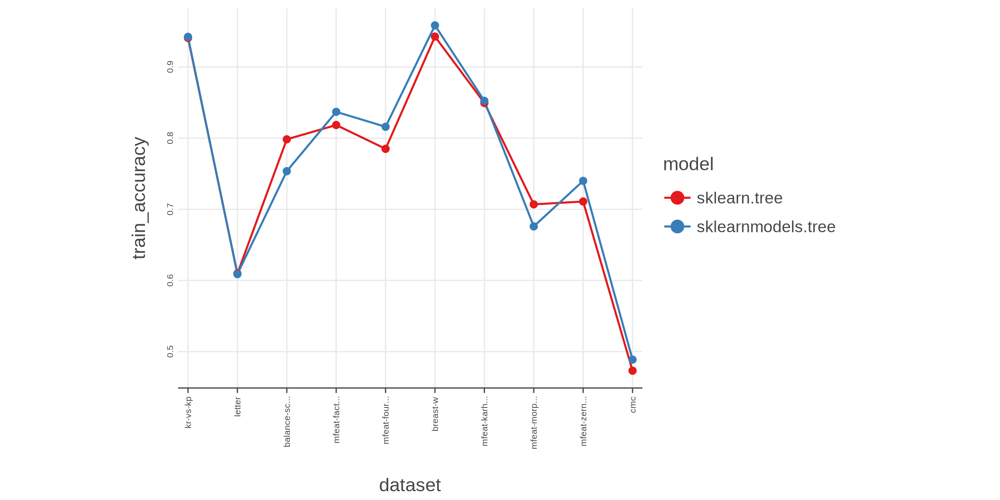
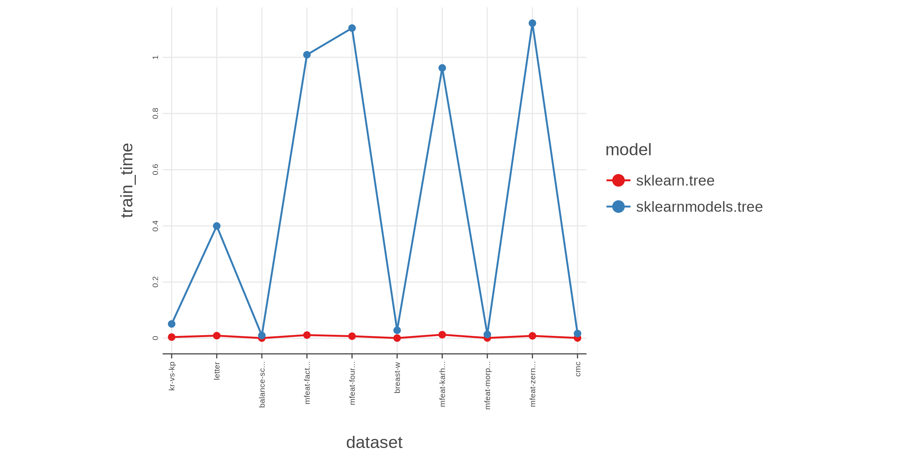
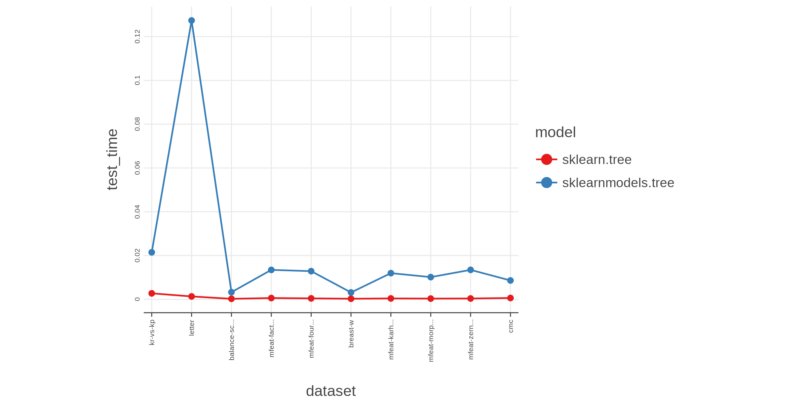
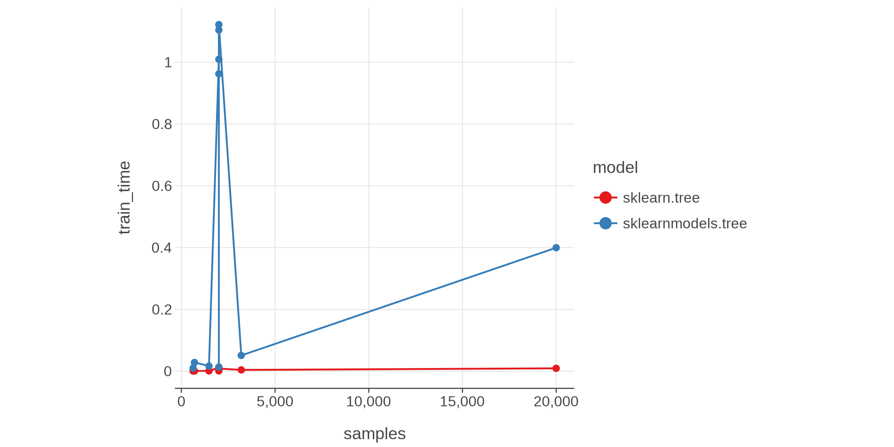
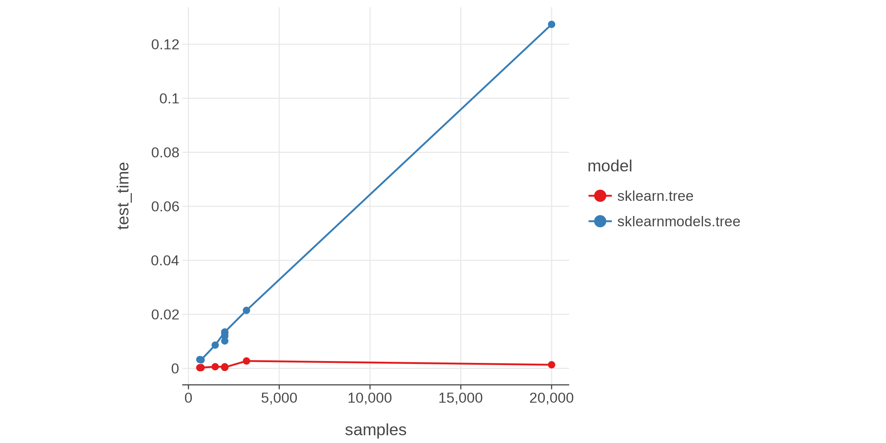
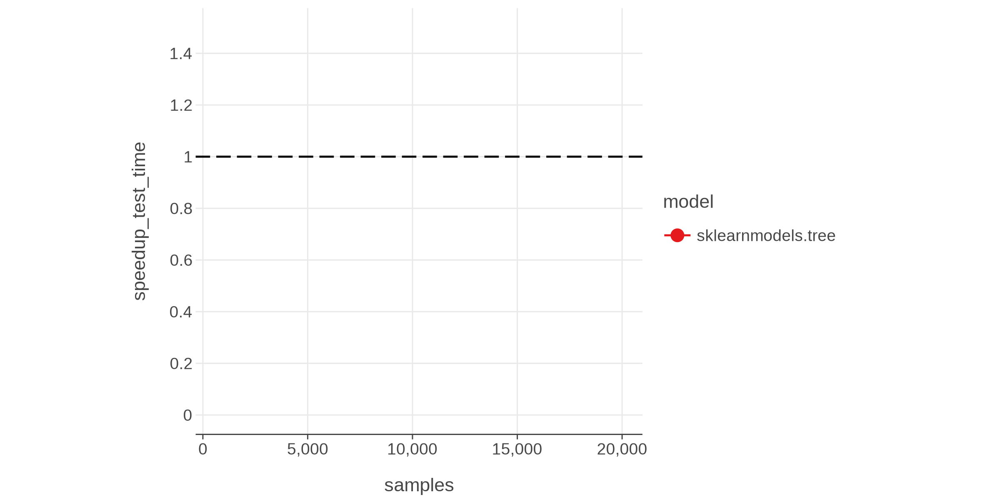
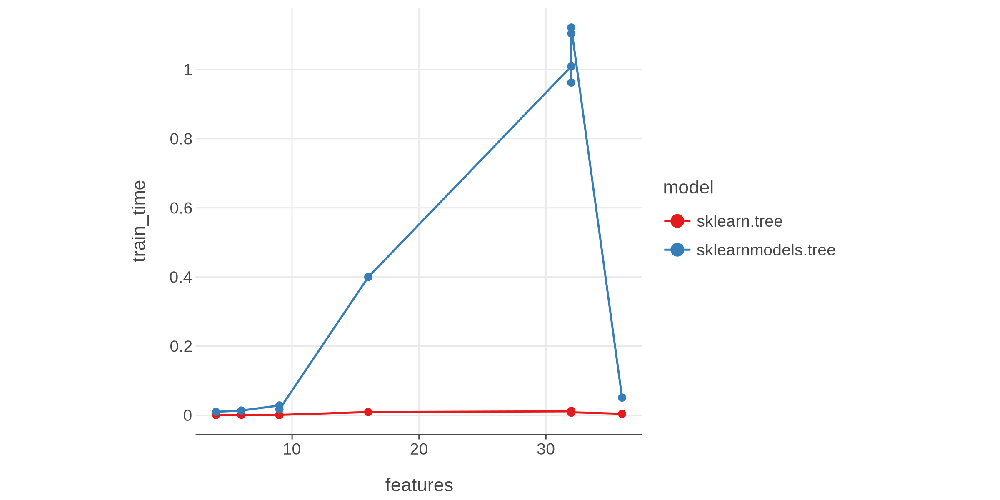
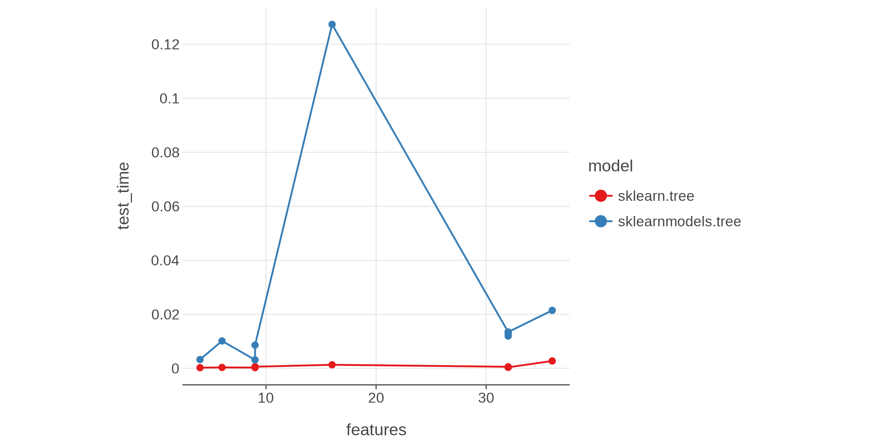
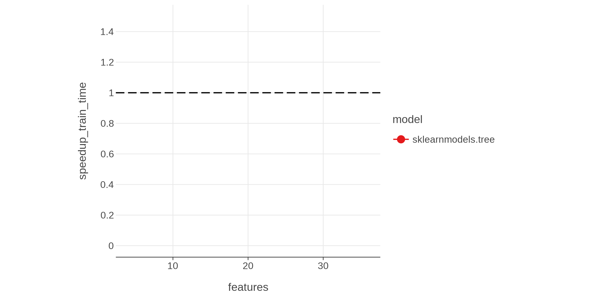

# Benchmark table
| model              | dataset             |   train_accuracy |   train_time |   test_time |   samples |   features |
|:-------------------|:--------------------|-----------------:|-------------:|------------:|----------:|-----------:|
| sklearn.tree       | kr-vs-kp            |         0.940864 |  0.00410416  | 0.00273403  |      3196 |         36 |
| sklearn.tree       | letter              |         0.60975  |  0.00917135  | 0.00132763  |     20000 |         16 |
| sklearn.tree       | balance-scale       |         0.7984   |  0.000520091 | 0.00024768  |       625 |          4 |
| sklearn.tree       | mfeat-factors       |         0.8185   |  0.0112692   | 0.000588176 |      2000 |         32 |
| sklearn.tree       | mfeat-fourier       |         0.785    |  0.00726638  | 0.000441922 |      2000 |         32 |
| sklearn.tree       | breast-w            |         0.942775 |  0.000564457 | 0.00027991  |       699 |          9 |
| sklearn.tree       | mfeat-karhunen      |         0.8495   |  0.0126234   | 0.000410846 |      2000 |         32 |
| sklearn.tree       | mfeat-morphological |         0.707    |  0.000955569 | 0.000343298 |      2000 |          6 |
| sklearn.tree       | mfeat-zernike       |         0.711    |  0.00844208  | 0.000387238 |      2000 |         32 |
| sklearn.tree       | cmc                 |         0.473184 |  0.000990363 | 0.000612134 |      1473 |          9 |
| sklearnmodels.tree | kr-vs-kp            |         0.942428 |  0.0509157   | 0.0214751   |      3196 |         36 |
| sklearnmodels.tree | letter              |         0.6089   |  0.399612    | 0.127368    |     20000 |         16 |
| sklearnmodels.tree | balance-scale       |         0.7536   |  0.0098326   | 0.00326521  |       625 |          4 |
| sklearnmodels.tree | mfeat-factors       |         0.837    |  1.00925     | 0.0134479   |      2000 |         32 |
| sklearnmodels.tree | mfeat-fourier       |         0.816    |  1.10418     | 0.0128703   |      2000 |         32 |
| sklearnmodels.tree | breast-w            |         0.958512 |  0.0281741   | 0.00314534  |       699 |          9 |
| sklearnmodels.tree | mfeat-karhunen      |         0.8525   |  0.962331    | 0.0119592   |      2000 |         32 |
| sklearnmodels.tree | mfeat-morphological |         0.676    |  0.0134898   | 0.0101491   |      2000 |          6 |
| sklearnmodels.tree | mfeat-zernike       |         0.74     |  1.12168     | 0.0134562   |      2000 |         32 |
| sklearnmodels.tree | cmc                 |         0.488798 |  0.0167401   | 0.00861554  |      1473 |          9 |
## Graphs
 All times are specified in seconds

