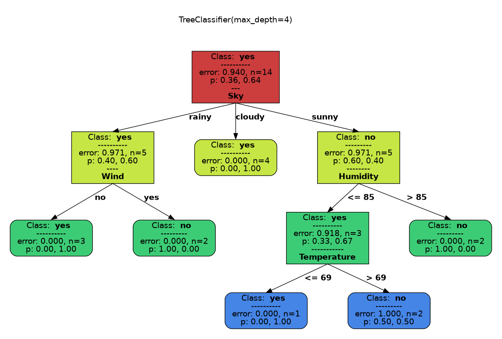

.. _quick_start:

###############
Getting started
###############

Colab Quickstart
====================

Check our  `classification models notebook <https://colab.research.google.com/github/facundoq/sklearn_nominal/blob/main/examples/Classification%20Models.ipynb>`__ and `regression models notebook <https://colab.research.google.com/github/facundoq/sklearn_nominal/blob/main/examples/Regression%20Models.ipynb>`__ to see samples of `sklearn_nominal` models in action with simple datasets.

Installing `sklearn_nominal`
===================================================

`sklearn_nominal` is provided as a pip package. To install simply use:

.. prompt:: bash $

  pip install sklearn_nominal

Or if using `uv`:

.. prompt:: bash $

  uv add sklearn_nominal

Installing `sklearn_nominal` with export support for Trees
=========================================================== 

Install using `sklearn_nominal[export]` to include support for exporting trees as png/pdf/svg.

WARNING: You need a working graphviz installation with headers in your system for export support. In ubuntu, use `sudo apt install libgraphviz-dev` to install the headers. This is a requirement of the `pygraphviz` and `graphviz` packages.

Fitting and evaluating a nominal model
----------------------------------------

The process is the same as with any other `scikit-learn` model:

.. literalinclude :: ../examples/train_tree_classifier.py
   :language: python

In this case, we can inspect the tree that uses the nominal attributes directly afterwards:

   Tree generated after training on the Golf dataset.

Comparing nominal classifiers
----------------------------------------

We can compare the classifiers in terms of their accuracy for the same task.
We can also `pretty_print` each to visualize their differences.

.. literalinclude :: ../examples/compare_classifiers.py
   :language: python

The results can be compared in this table:

.. csv-table:: Classifier Comparison
   :file: classifier_comparison.csv
   :widths: 5,65,15,15
   :header-rows: 1
